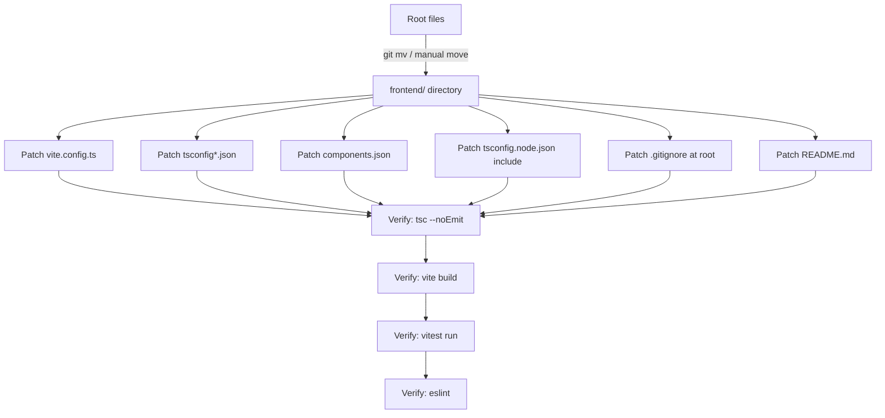

# Design Document: Frontend Refactor

## Overview

This design covers the mechanical process of moving all frontend files from the repository root into a `frontend/` subdirectory, updating every configuration file that contains path references, and verifying that the full development workflow (dev server, build, lint, test, Playwright) continues to work correctly from the new location.

The repository currently has this shape:

```
repo-root/
  src/
  public/
  index.html
  package.json
  vite.config.ts
  tsconfig*.json
  eslint.config.js
  postcss.config.js
  components.json
  playwright.config.ts
  playwright-fixture.ts
  bun.lock / bun.lockb / package-lock.json
  backend/
  .gitignore
  README.md
```

After the refactor it will look like:

```
repo-root/
  frontend/
    src/
    public/
    index.html
    package.json
    vite.config.ts
    tsconfig.json
    tsconfig.app.json
    tsconfig.node.json
    eslint.config.js
    postcss.config.js
    components.json
    playwright.config.ts
    playwright-fixture.ts
    bun.lock / bun.lockb / package-lock.json
  backend/
  .gitignore
  README.md
```

## Architecture

The refactor is a pure structural change — no application logic is altered. The work falls into three sequential phases:

1. **Move** — physically relocate files/directories into `frontend/`.
2. **Patch configs** — update every config file whose paths are now wrong because `__dirname` or the working directory has changed.
3. **Verify** — confirm the toolchain works end-to-end from `frontend/`.



## Components and Interfaces

### Files Being Moved (no content change needed)

| File / Directory | Notes |
|---|---|
| `src/` | All internal `@/` imports remain valid — alias is re-pointed in config |
| `public/` | Static assets, no path references |
| `index.html` | Vite entry point, no path changes needed |
| `postcss.config.js` | Plugin names only, no paths |
| `playwright-fixture.ts` | Only re-exports from an npm package, no local paths |
| `bun.lock`, `bun.lockb`, `package-lock.json` | Lockfiles, no path references |

### Files Being Moved (content must be updated)

| File | What changes |
|---|---|
| `vite.config.ts` | `path.resolve(__dirname, "./src")` stays correct because `__dirname` is now `frontend/` |
| `tsconfig.json` | `paths["@/*"]` already points to `./src/*` — stays correct; `references` paths stay correct |
| `tsconfig.app.json` | `include: ["src"]` stays correct; `paths["@/*"]` stays correct |
| `tsconfig.node.json` | `include: ["vite.config.ts"]` stays correct |
| `components.json` | `tailwind.css` points to `src/index.css` — stays correct; aliases use `@/` — stays correct |
| `eslint.config.js` | `ignores: ["dist"]` stays correct |
| `package.json` | No path changes; scripts are relative to cwd which will be `frontend/` |

> **Key insight:** Because every existing path reference is already relative (e.g., `./src`, `src`, `dist`) and uses the working directory or `__dirname` as the base, moving the files into `frontend/` does not break any of them — the relative relationships are preserved. The only files that need new content are the root `.gitignore` and `README.md`.

### Root-Level Files Being Modified (not moved)

| File | Change |
|---|---|
| `.gitignore` | Add `frontend/node_modules/`, `frontend/dist/`, `frontend/.env*` patterns |
| `README.md` | Update project structure diagram and frontend setup commands |

## Data Models

This refactor has no data models. The "data" is the file system layout and configuration values.

### Configuration Value Map

The table below captures every path-sensitive value and its state after the move.

| Config File | Key | Before | After |
|---|---|---|---|
| `vite.config.ts` | `resolve.alias["@"]` | `path.resolve(__dirname, "./src")` | unchanged (still correct) |
| `tsconfig.json` | `paths["@/*"]` | `["./src/*"]` | unchanged |
| `tsconfig.json` | `references[0].path` | `"./tsconfig.app.json"` | unchanged |
| `tsconfig.json` | `references[1].path` | `"./tsconfig.node.json"` | unchanged |
| `tsconfig.app.json` | `include` | `["src"]` | unchanged |
| `tsconfig.app.json` | `paths["@/*"]` | `["./src/*"]` | unchanged |
| `tsconfig.node.json` | `include` | `["vite.config.ts"]` | unchanged |
| `components.json` | `tailwind.css` | `"src/index.css"` | unchanged |
| `components.json` | `aliases.*` | `"@/components"` etc. | unchanged |
| `.gitignore` | new patterns | _(absent)_ | `frontend/node_modules/`, `frontend/dist/`, `frontend/.env*` |

## Error Handling

### Potential Failure Points and Mitigations

**1. Broken `@` alias after move**
- Risk: If any tool resolves `@` relative to the repo root rather than the config file location, imports will break.
- Mitigation: `vite.config.ts` uses `path.resolve(__dirname, "./src")` which is always relative to the config file itself. TypeScript uses the tsconfig location. Both are safe after the move.

**2. `node_modules` not present in `frontend/`**
- Risk: After moving `package.json`, `node_modules/` (if it exists at root) is not automatically moved.
- Mitigation: The task plan includes a step to run `npm install` (or `bun install`) from `frontend/` after the move. The old root `node_modules/` should be deleted.

**3. Lockfile conflicts**
- Risk: Both `bun.lock`/`bun.lockb` and `package-lock.json` exist. Moving them is fine; they are tied to `package.json` by content, not location.
- Mitigation: Move all lockfiles together with `package.json`. Run the appropriate package manager from `frontend/` to verify integrity.

**4. `.gitignore` root patterns no longer covering frontend artifacts**
- Risk: `node_modules` and `dist` at root level are ignored, but `frontend/node_modules` and `frontend/dist` are not.
- Mitigation: Explicitly add `frontend/node_modules/`, `frontend/dist/`, and `frontend/.env*` to the root `.gitignore`.

**5. CI/CD pipeline paths**
- Risk: Any CI workflow files (e.g., GitHub Actions) that reference root-level frontend commands will break.
- Mitigation: Check `.github/` for workflow files and update `working-directory` or `cd` commands. (No `.github/` directory was found in this repo, so this is low risk currently.)

**6. Vercel/Railway deployment config**
- Risk: Vercel's `vercel.json` or dashboard settings may point to the root as the frontend root directory.
- Mitigation: Update Vercel project settings to set the root directory to `frontend/`. Document this in the README.

## Testing Strategy

This feature is a structural refactoring with no new business logic. PBT is not applicable — there are no universal properties that vary meaningfully with input. All acceptance criteria are either structural smoke checks or configuration content verifications.

### Smoke Tests (structural checks)

Run after the move is complete, before starting any toolchain:

- Root directory contains exactly: `frontend/`, `backend/`, `.git/`, `.gitignore`, `.kiro/`, `.vscode/`, `README.md`
- `frontend/` contains all expected files: `src/`, `public/`, `index.html`, `package.json`, `vite.config.ts`, `tsconfig.json`, `tsconfig.app.json`, `tsconfig.node.json`, `eslint.config.js`, `postcss.config.js`, `components.json`, `playwright.config.ts`, `playwright-fixture.ts`, and lockfiles
- No frontend files remain at the root (spot-check `index.html`, `package.json`, `vite.config.ts`)

### Example / Configuration Tests

Verify configuration file contents are correct:

- `frontend/vite.config.ts`: `resolve.alias["@"]` uses `path.resolve(__dirname, "./src")`
- `frontend/tsconfig.json`: `paths["@/*"]` is `["./src/*"]`; references point to `./tsconfig.app.json` and `./tsconfig.node.json`
- `frontend/tsconfig.app.json`: `include` is `["src"]`; `paths["@/*"]` is `["./src/*"]`
- `frontend/tsconfig.node.json`: `include` is `["vite.config.ts"]`
- `frontend/components.json`: `tailwind.css` is `"src/index.css"`; aliases use `@/` prefix
- Root `.gitignore`: contains `frontend/node_modules/`, `frontend/dist/`, `frontend/.env*`
- `README.md`: documents `frontend/` and `backend/` as sibling directories; frontend commands reference `cd frontend/`

### Integration Tests (manual / CI)

Run from the `frontend/` directory after `npm install` or `bun install`:

| Command | Expected outcome |
|---|---|
| `tsc --noEmit` | Zero type errors |
| `vite build` | Build completes, `frontend/dist/` created |
| `vite` (dev server) | Starts on port 8080, app renders |
| `vitest run` | All tests pass |
| `eslint .` | Zero new lint errors |
| `playwright test` | All e2e tests pass |
