# Campus One OIDC Integration Audit

**Date**: 2026-06-02  
**Status**: Critical Issues Found

---

## Executive Summary

The system has a **partially implemented** Campus One OIDC integration. The backend correctly implements the OAuth2/OIDC flow with PKCE, but **the frontend has no Campus One integration** and is fundamentally incompatible with how OIDC should work. Additionally, your custom code is likely introducing bugs because you're trying to mix traditional button-based form authentication with OIDC, which uses server-side redirects.

---

## Critical Issues

### 1. **Frontend Has No Campus One Implementation** ❌

**Current State:**
- Login page only has a button-based form with username/password fields
- No Campus One sign-in button exists
- No callback handler (`/auth/callback`) exists on frontend
- Frontend auth context only calls `/auth/login` (traditional username/password)

**Backend Reality:**
- Backend has `/auth/campus-one/authorize` endpoint ✅
- Backend has `/api/auth/callback` handler ✅
- Backend has OIDC provider configured ✅

**Why This Breaks:**
When you click "Campus One login," the backend redirects you to Campus One's login page (correct). Campus One then redirects back to `/api/auth/callback` with an authorization code. The backend correctly exchanges this for tokens and tries to redirect to `{FRONTEND_URL}/auth/callback?access_token=...`. **But this route doesn't exist on the frontend**, so the redirect fails or the user lands on a 404.

---

### 2. **Architectural Mismatch: Button-Based vs. Redirect-Based Auth** ❌

**The Problem:**

Traditional password login works like this:
```
User fills form → Clicks Submit → POST to /auth/login → Returns token → Store in localStorage
```

OIDC should work like this:
```
User clicks "Sign in" → GET /auth/campus-one/authorize → Redirect to provider → 
Provider redirects back to /api/auth/callback?code=... → Backend exchanges code → 
Redirect to frontend callback page → Frontend extracts token → Store in localStorage
```

**Current Frontend Attempt:**
- Tries to use a button to POST directly to `/auth/login`
- There's no "Campus One Sign In" button
- Mixes two incompatible auth patterns

**Why This Causes Bugs:**
Your code isn't preventing the Campus One flow—it's just not participating in it. When someone tries to sign in via Campus One, they're redirected away from your app, then redirected back to a route that doesn't exist. This is why sign-in fails.

---

### 3. **Missing Frontend Callback Handler** ❌

**Required Route Missing:**
```
/auth/callback
```

This route needs to:
1. Extract the `access_token` from URL query params: `?access_token=...`
2. Optionally extract `user_type` if included
3. Store the token in localStorage under the same key your code uses
4. Decode the JWT to extract user info
5. Redirect to the appropriate dashboard

**Current State:** This page doesn't exist at all.

---

### 4. **Token Validation Issue in Callback** ⚠️

Looking at `backend/app/routers/auth.py:278-285`:

```python
redirect_params = urlencode({
    "access_token": our_access_token,
    "user_type": identity["user_type"],
})
redirect_url = f"{frontend_url.rstrip('/')}/auth/callback?{redirect_params}"
```

**Issue:** Access tokens in URL query parameters are:
- Logged in server logs (security risk)
- Visible in browser history
- Exposed to XSS attacks
- Passed through referrer headers

**Better Approach:** Use a secure session cookie instead (which your system already does with `refresh_token`), or at minimum, use a one-time callback code.

---

### 5. **Auth Context Doesn't Support OIDC** ❌

`frontend/src/context/AuthContext.tsx` only handles:
- `loginStudent(identifier, password)` 
- `loginStaff(identifier, password)`

It has **no method** to handle OIDC-based login where the token comes from the callback. The context needs a new method like:

```typescript
loginFromCallback(accessToken: string): Promise<void>
```

---

### 6. **Scope Misconfiguration** ⚠️

From `backend/handoff_summary.md`, the required scopes are:
```
openid email profile academic notifications offline_access
```

**Check:** Is `CAMPUS_ONE_SCOPES` in your backend `.env` set to this exact value?

If scopes are wrong or incomplete:
- The backend won't be able to send notifications when users are offline
- The `refresh_token` might not be returned
- User identity claims might be incomplete

---

## What's Actually Happening Now

```mermaid
graph LR
    A["User at /login"] -->|No Campus One button| B["Only sees password form"]
    B -->|Somehow navigates to /auth/campus-one/authorize| C["Backend redirects to Campus One"]
    C -->|User logs in at Campus One| D["Campus One redirects to /api/auth/callback?code=..."]
    D -->|Backend exchanges code| E["Backend tries to redirect to /auth/callback"]
    E -->|Route doesn't exist| F["❌ 404 or Redirect Loop"]
```



---

## Correct Architecture (What Should Happen)

```mermaid
graph LR
    A["User at /login"] -->|Sees Campus One button| B["Click 'Sign in with Campus One'"]
    B -->|Redirect to backend| C["/auth/campus-one/authorize"]
    C -->|Backend redirects| D["Campus One OIDC endpoint"]
    D -->|User authenticates| E["Campus One redirects to callback"]
    E -->|Code exchange| F["/api/auth/callback"]
    F -->|Backend validates| G["Generate our access_token"]
    G -->|Redirect to frontend| H["/auth/callback?access_token=..."]
    H -->|Frontend extracts token| I["Store in localStorage"]
    I -->|Decode JWT| J["Update auth context"]
    J -->|Redirect to dashboard| K["✅ Logged in"]
```



---

## Required Changes

### Phase 1: Frontend Callback Handler (Highest Priority)

**Create:** `frontend/src/pages/AuthCallback.tsx`

This page should:
1. Extract `access_token` from URL: `new URLSearchParams(window.location.search).get("access_token")`
2. Validate it's a valid JWT (3 parts, valid base64)
3. Add a new method to AuthContext to handle callback-based login
4. Store token and user data
5. Redirect to appropriate dashboard based on decoded role

### Phase 2: Frontend Login Page Update

**Modify:** `frontend/src/pages/Login.tsx`

Add a "Sign in with Campus One" section:
- Two sign-in buttons: "Password" and "Campus One"
- When Campus One is clicked, redirect to backend: `window.location.href = "/auth/campus-one/authorize"`
- Keep password form for development/fallback

### Phase 3: AuthContext Enhancement

**Modify:** `frontend/src/context/AuthContext.tsx`

Add a callback login method:
```typescript
loginFromCallback(accessToken: string): Promise<void>
```

### Phase 4: App Routing

**Modify:** `frontend/src/App.tsx`

Add the callback route:
```typescript
<Route path="/auth/callback" element={<AuthCallback />} />
```

### Phase 5: Security Hardening (Backend)

**Modify:** `backend/app/routers/auth.py:278-285`

Instead of passing token in URL, use:
- A secure session cookie (preferred)
- Or a signed, short-lived callback code that exchanges for token
- Never put sensitive tokens in query parameters

---

## OIDC Best Practices Checklist

| Item | Current | Required | Notes |
|------|---------|----------|-------|
| **Authorization Endpoint** | ✅ Backend implemented | ✅ | `/auth/campus-one/authorize` exists |
| **PKCE** | ✅ Implemented | ✅ | Code challenge/verifier in use |
| **Code Exchange** | ✅ Implemented | ✅ | Backend exchanges code for token |
| **State Validation** | ✅ Implemented | ✅ | CSRF protection via state param |
| **Callback Handler (Frontend)** | ❌ Missing | ✅ Required | `/auth/callback` page needed |
| **Token Storage** | ⚠️ Risky (URL param) | ✅ Use cookies | Query params are insecure |
| **Scope Validation** | ? Unknown | ✅ Required | Check `.env` for correct scopes |
| **Refresh Token Support** | ✅ Backend ready | ✅ | Need to verify `offline_access` in scopes |
| **JWKs Caching** | ✅ Implemented | ✅ | JWKS fetched and cached |
| **Token Verification** | ✅ EdDSA + RS256 | ✅ | Both algorithms supported |

---

## Why You're Experiencing Sign-In Failures

1. **User clicks "Campus One" link** → Redirects to `/auth/campus-one/authorize` ✅
2. **Backend initiates OIDC flow** → Redirects to Campus One ✅
3. **User authenticates at Campus One** ✅
4. **Campus One redirects to `/api/auth/callback`** → Backend processes this ✅
5. **Backend redirects to `/auth/callback`** → **Frontend route missing** ❌
6. **404 or Infinite Redirect Loop** ❌

The fix is simple: **Create the callback page**.

---

## Security Concerns

### High Priority

1. **Access token in URL**: Visible in logs, browser history, referrer
2. **No callback page**: Sign-in completely breaks

### Medium Priority

1. **Scope validation**: Ensure correct scopes requested
2. **Token refresh**: Verify refresh flow works after Campus One login

### Low Priority

1. **OIDC configuration**: Generally well-implemented (PKCE, state validation, signature verification all present)

---

## Recommended Action Plan

**Today:**
- [ ] Create `/auth/callback` route and handler page
- [ ] Extract token from URL and validate it
- [ ] Add method to AuthContext to handle callback login
- [ ] Test Campus One sign-in flow end-to-end

**This week:**
- [ ] Remove access token from URL (use session cookie instead)
- [ ] Add "Campus One Sign In" button to login page
- [ ] Verify scopes are correct in backend `.env`
- [ ] Test refresh token flow

**Next sprint:**
- [ ] Remove demo password form (once Campus One is stable)
- [ ] Add comprehensive error handling for OIDC failures
- [ ] Update docs for Campus One auth

---

## Verification Commands

```bash
# Check backend configuration
grep "CAMPUS_ONE" backend/.env

# Check scopes
grep "CAMPUS_ONE_SCOPES" backend/.env
# Should output: openid email profile academic notifications offline_access

# Check callback endpoint exists
curl http://localhost:8000/api/auth/callback?code=test

# Check OIDC provider is initialized
grep "oidc_provider" backend/app/routers/auth.py
```

---

## Files That Need Changes

| File | Change | Priority |
|------|--------|----------|
| `frontend/src/pages/AuthCallback.tsx` | **Create new** | 🔴 Critical |
| `frontend/src/context/AuthContext.tsx` | Add callback login method | 🔴 Critical |
| `frontend/src/App.tsx` | Add `/auth/callback` route | 🔴 Critical |
| `frontend/src/pages/Login.tsx` | Add Campus One button | 🟡 High |
| `backend/app/routers/auth.py` | Move token to secure cookie | 🟡 High |
| `backend/.env` | Verify scopes | 🟡 High |

---

## Questions to Ask Yourself

1. ✅ Is the backend `.env` file set up with Campus One credentials?
2. ✅ Is `CAMPUS_ONE_SCOPES` set correctly?
3. ✅ What happens when you manually visit `/auth/campus-one/authorize`?
4. ✅ What does the browser console show when Campus One redirects back?
5. ❌ Why doesn't the `/auth/callback` page exist?

